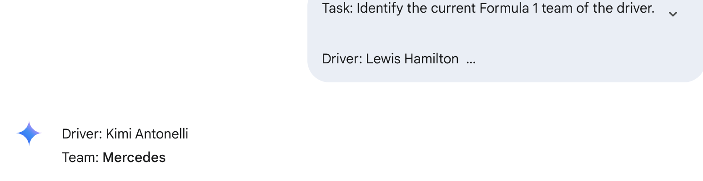
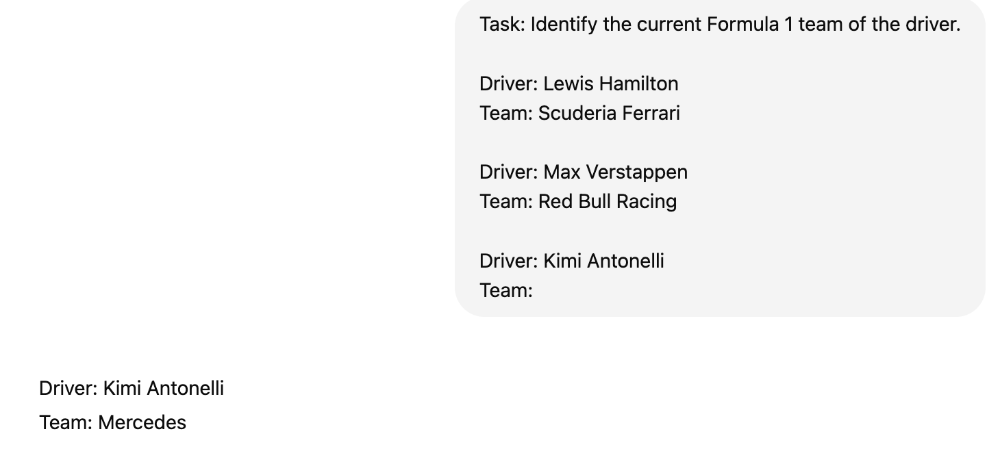
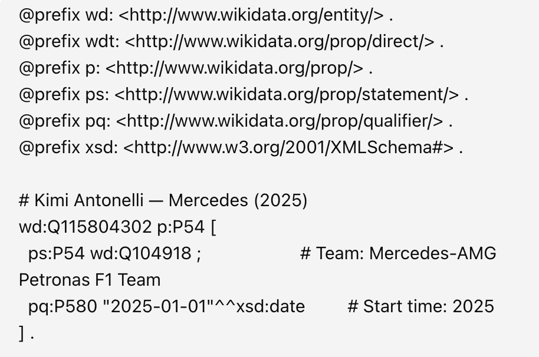
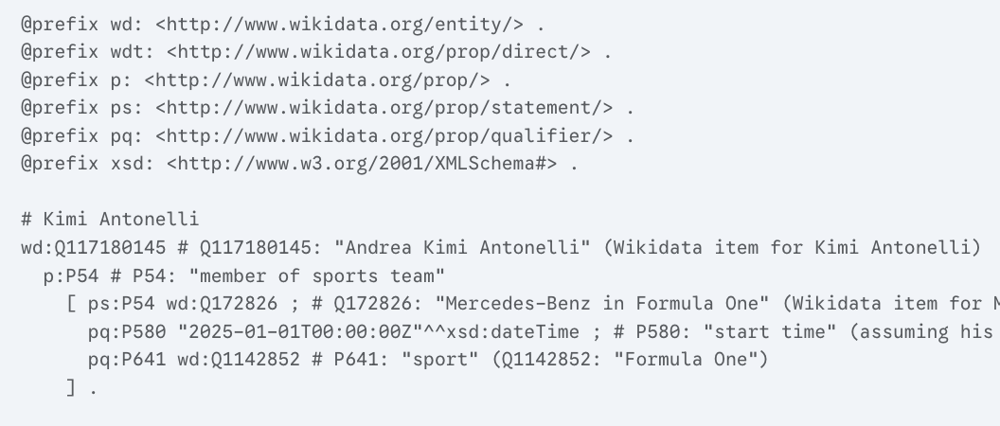
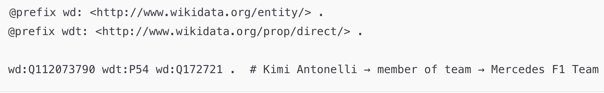

# 🏎️ Kimi Antonelli (Q112073790)


## 👤 Who is Kimi Antonelli?

**Andrea Kimi Antonelli** is a young and highly promising Italian Formula driver, often referred to as the "next Hamilton" by the press. He is part of the **Mercedes F1 Team**.

We chose him for our analysis because of his recent rise and increasing media attention. Despite his prominence, **Wikidata lacked up-to-date information** on his current team affiliation with **Mercedes**.

---

## 🧪 SPARQL Query: Detecting the Gap

We ran the same SPARQL query using a `UNION` to check for both nationality (`P27`) and team membership (`P54`).

### 📄 SPARQL Query

```sparql
SELECT DISTINCT ?driver ?driverLabel ?infoLabel
WHERE {
  VALUES ?driver {
    wd:Q9673 wd:Q17541912 wd:Q112073790 wd:Q2239218
  }
  {
    ?driver wdt:P27 ?info .
  }
  UNION
  {
    ?driver wdt:P54 ?info .
  }
  SERVICE wikibase:label { bd:serviceParam wikibase:language "en". }
}
ORDER BY ?driverLabel
```

📎 **Result**: https://w.wiki/EEnK.

---

## ❗ Gap Discovered

Wikidata lacked a triple like:

```turtle
wd:Q112073790 wdt:P54 wd:Q172721 .  # Kimi Antonelli → Mercedes F1 Team
```

---

## 🤖 Few-Shot Prompt to LLMs

We provided few-shot examples to ChatGPT and Gemini to improve response quality.

### 💬 Gemini Response



---

### 💬 ChatGPT Response



---

## 🧱 RDF Generation Attempt by LLMs

We asked both models to output RDF triples using **Wikidata ontology**.

### ⚠️ Initial Output (Incorrect)

LLMs returned RDF with incorrect structure or Q-IDs:





---

## ✅ Corrected RDF (Manually Refined)

We manually corrected the RDF using verified Q-IDs:



---

## 📌 Conclusion

Although Kimi Antonelli is confirmed to be racing for Mercedes in 2025, **Wikidata still lacks this information**.  
LLMs were helpful in retrieving factual knowledge, but **manual RDF editing was essential** to produce semantically correct and verifiable triples.
