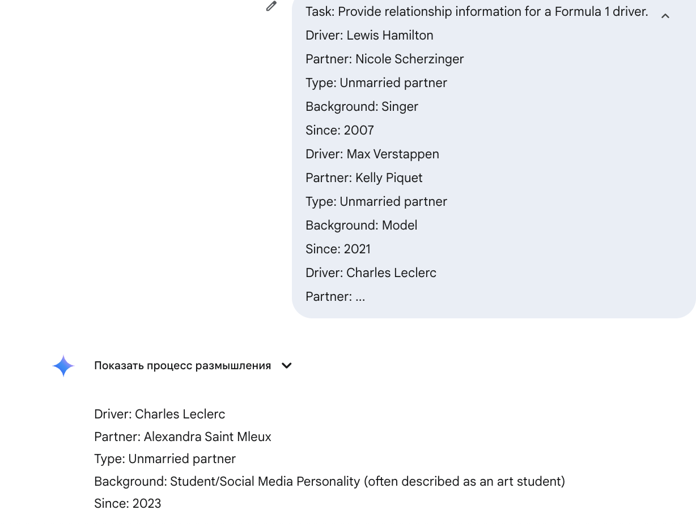
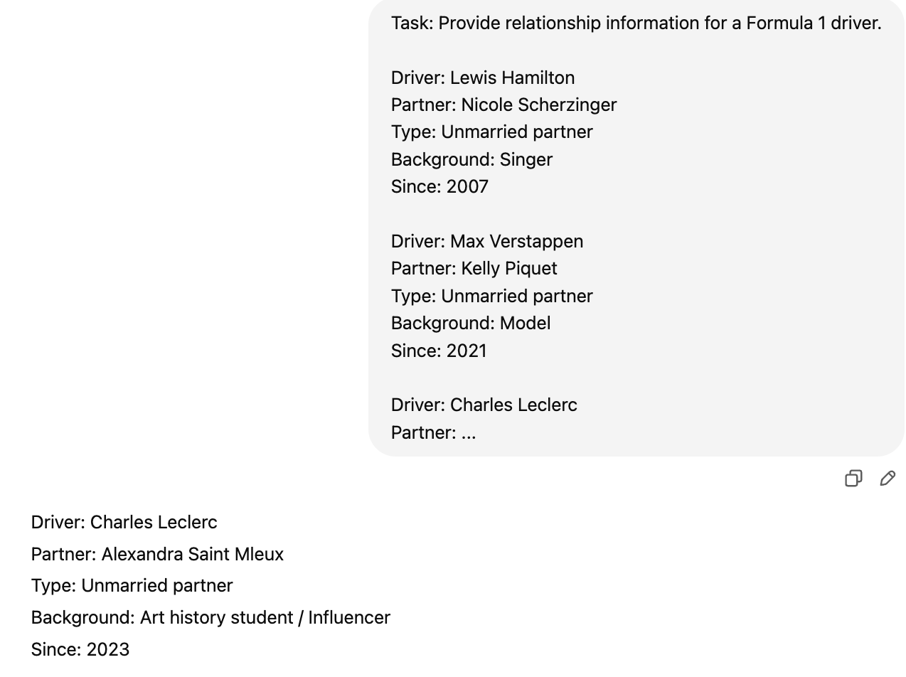
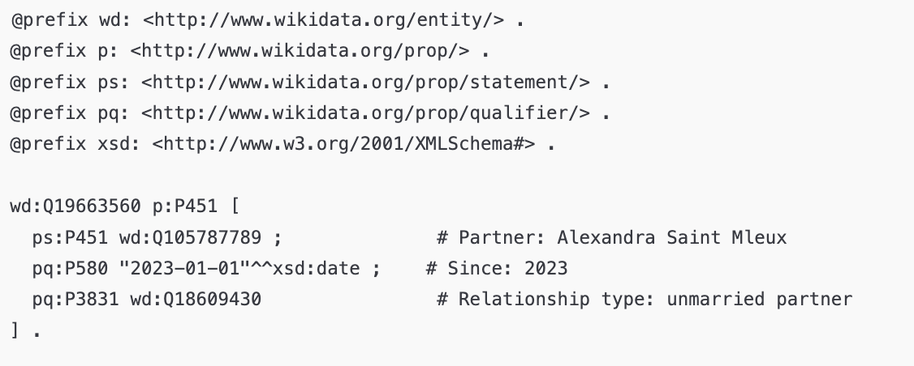
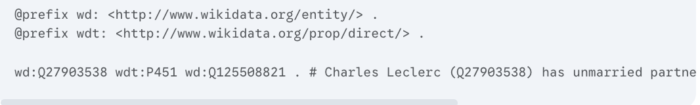
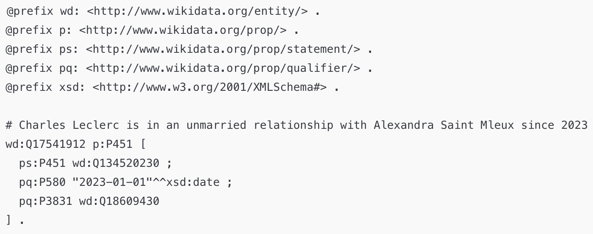

# 🏎️ Charles Leclerc (Q17541912)


## 👤 Who is Charles Leclerc?

**Charles Leclerc** is a Monegasque Formula 1 driver competing for **Scuderia Ferrari**. Known for his talent, consistency, and charisma, Leclerc is a central figure in F1’s new generation.  
We chose him for this project because, despite his visibility and media presence, **Wikidata omitted a key aspect of his personal life**—his current relationship.

---

## 🧪 SPARQL Query: Finding Relationship Data

To compare relationship data across drivers, we ran the following query using `OPTIONAL` and `ORDER BY`:

### 📄 SPARQL Query

```sparql
SELECT ?driver ?driverLabel ?partner ?partnerLabel
WHERE {
  VALUES ?driver {
    wd:Q9673 wd:Q17541912 wd:Q112073790 wd:Q2239218
  }
  OPTIONAL { ?driver wdt:P451 ?partner . }

  SERVICE wikibase:label { bd:serviceParam wikibase:language "en". }
}
ORDER BY ?driverLabel
```

📎 **Result**: Charles Leclerc has **no recorded partner** in Wikidata, while Hamilton and Verstappen do. Antonelli has no data (likely due to age).

---

## ❗ Gap Discovered

According to multiple sources, **Charles Leclerc has been in a relationship with Alexandra Saint Mleux since 2023**, yet this information is missing from Wikidata.

---

## 🤖 Few-Shot Prompting

We asked both LLMs (ChatGPT and Gemini) using a **few-shot prompt** to retrieve relationship information.

### 💬 Gemini Response



---

### 💬 ChatGPT Response



Both models confirmed the relationship with **Alexandra Saint Mleux**, dating back to 2023.

---

## 🧱 RDF Generation Attempt by LLMs

We asked the models to generate RDF triples using **Wikidata ontology**.

### ⚠️ RDF Output: Incorrect Examples





Both models made **mistakes with Q-IDs**, though ChatGPT included useful temporal qualifiers.

---

## ✅ Corrected RDF (Manually Refined)

We corrected the RDF using valid Wikidata identifiers:

```turtle
@prefix wd: <http://www.wikidata.org/entity/> .
@prefix p: <http://www.wikidata.org/prop/> .
@prefix ps: <http://www.wikidata.org/prop/statement/> .
@prefix pq: <http://www.wikidata.org/prop/qualifier/> .
@prefix xsd: <http://www.w3.org/2001/XMLSchema#> .

# Charles Leclerc is in an unmarried relationship with Alexandra Saint Mleux since 2023
wd:Q17541912 p:P451 [
  ps:P451 wd:Q134520230 ;
  pq:P580 "2023-01-01"^^xsd:date ;
  pq:P3831 wd:Q18609430
] .
```



---

## 📌 Conclusion

This case highlights how **personal relationship data** can be overlooked even for public figures.  
We identified the gap using `OPTIONAL`, `ORDER BY`, and `SERVICE` in SPARQL.  
LLMs were helpful for retrieving facts, but **manual RDF editing ensured correctness and consistency**.
