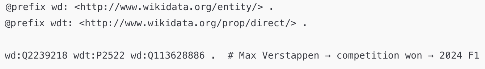

# 🏎️ Max Verstappen (Q2239218)


## 👤 Who is Max Verstappen?

**Max Verstappen** is a Dutch Formula 1 driver and reigning world champion, widely considered one of the most dominant athletes in modern motorsports. As the lead driver for **Red Bull Racing**, he has broken multiple records and secured consecutive world titles.

We selected him because, despite his high profile and widely recognized victory in the **2024 Formula One World Championship**, this information was **not yet included in Wikidata** at the time of querying.

---

## 🧪 SPARQL Query: Checking for World Championship Wins

We used the following SPARQL query to identify which of the selected drivers had won a Formula One World Championship.

### 📄 SPARQL Query

```sparql
SELECT ?driver ?driverLabel ?competitionLabel
WHERE {
  VALUES ?driver {
    wd:Q9673 wd:Q17541912 wd:Q112073790 wd:Q2239218
  }

  ?driver wdt:P2522 ?competition .

  SERVICE wikibase:label { bd:serviceParam wikibase:language "en". }
}
ORDER BY ?driverLabel
```

📎 **Result**: [https://w.wiki/EEpB](https://w.wiki/EEpB)

---

## ❗ Gap Discovered

The query revealed that **Max Verstappen’s victory in the 2024 Formula One World Championship (Q113628886)** was **missing** from his Wikidata entry.

Expected triple:

```turtle
wd:Q2239218 wdt:P2522 wd:Q113628886 .
```

---

## 🧠 Chain-of-Thought Prompting

We asked both ChatGPT and Gemini to reason step-by-step (Chain-of-Thought) to identify the 2024 champion.

### 💬 Gemini Response (CoT)


Gemini correctly identified Verstappen as the 2024 champion, mentioning the **Las Vegas Grand Prix**.

---

### 💬 ChatGPT Response (CoT)


ChatGPT also confirmed Verstappen’s win, and provided detailed structure: season overview, challenges, and historic significance.

---

## 🧱 RDF Generation Attempt by LLMs

We asked both LLMs to generate RDF triples using **Wikidata ontology**.

### ⚠️ RDF Output: Incorrect Examples


ChatGPT included additional context (event and date), but **used incorrect Q-IDs**.

---

## ✅ Corrected RDF (Manually Refined)

We reviewed the data and created the correct RDF:

```turtle
@prefix wd: <http://www.wikidata.org/entity/> .
@prefix wdt: <http://www.wikidata.org/prop/direct/> .

wd:Q2239218 wdt:P2522 wd:Q113628886 .  # Max Verstappen → 2024 Formula One World Championship
```

Additionally, a more detailed RDF using qualifiers:

```turtle
@prefix wd: <http://www.wikidata.org/entity/> .
@prefix p: <http://www.wikidata.org/prop/> .
@prefix ps: <http://www.wikidata.org/prop/statement/> .
@prefix pq: <http://www.wikidata.org/prop/qualifier/> .
@prefix xsd: <http://www.w3.org/2001/XMLSchema#> .

wd:Q2239218 p:P2522 [
  ps:P2522 wd:Q113628886 ;
  pq:P585 "2024-11-24"^^xsd:date ;
  pq:P1344 wd:Q113980138  # Las Vegas Grand Prix
] .
```



---

## 📌 Conclusion

Although Max Verstappen is the confirmed 2024 champion, **Wikidata was missing this fact**.  
Using `VALUES`, `ORDER BY`, and `SERVICE` keywords in SPARQL, we identified the gap.  
With **Chain-of-Thought prompting**, we extracted correct facts from LLMs, though **RDF still required manual correction**.

This demonstrates that **LLMs can aid enrichment**, but **human validation remains crucial**.
